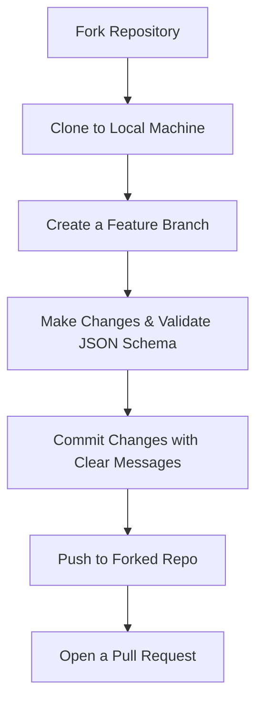

# 🤝 Contributing to ViHotel3k (Contribution Guidelines)

Welcome to **ViHotel3k**! We are delighted that you are interested in contributing to this project. Your support helps improve dataset quality, expand review counts, and advance research in Vietnamese Aspect-Based Sentiment Analysis (ABSA).

This document provides a step-by-step roadmap to guide you through proposing additions, formatting new reviews, and submitting contributions successfully.

---

## 📂 Project Directory Structure

The repository is organized into a clean and structured layout:
```text
ViHotel3k/
├── assets/                  # Project visualization charts
│   ├── chart*.png           # Aspect and sentiment breakdown charts
│   └── split*.png           # Split distribution charts
├── data/                    # Dataset directory containing raw data files
│   ├── train.json           # Training split
│   ├── dev.json             # Validation split
│   └── test.json            # Evaluation split
├── CONTRIBUTE.md            # Guidelines for open-source contributions
├── LICENSE                  # MIT License details
└── README.md                # Project documentation
```

---

## 🗺️ Contribution Workflow

To keep our data changes clean and manageable, please follow this standard workflow:



### 1. Forking & Cloning the Repository
1.  **Fork** this repository to your personal GitHub account by clicking the **Fork** button in the top-right corner of this page.
2.  Clone your forked repository locally:
    ```bash
    git clone https://github.com/YOUR_USERNAME/ViHotel3k.git
    cd ViHotel3k
    ```
3.  Set up the original repository as an `upstream` remote:
    ```bash
    git remote add upstream https://github.com/ORIGINAL_OWNER/ViHotel3k.git
    ```

### 2. Working in a Feature Branch
Always develop your updates in a dedicated branch. Avoid making commits directly on the `main` or `master` branches.
```bash
git checkout -b feature/your-contribution-name
# Example: git checkout -b feature/add-50-clean-reviews
```

---

## 📊 Dataset Contributions & Schema

If you would like to contribute new annotations or refine existing data labels, please make sure they adhere strictly to the JSON schema:

### JSON Data Format
Data files are located in the `data/` folder as `train.json`, `dev.json`, and `test.json`. They must be structured as a JSON Array of objects:

```json
[
  {
    "comment": "Phòng ốc sạch sẽ, rộng rãi nhưng nhân viên lễ tân phục vụ hơi chậm.",
    "label": {
      "ROOM#CLEANLINESS": "Positive",
      "ROOM#DESIGN": "Positive",
      "SERVICE#STAFF": "Negative"
    }
  }
]
```

### Valid Aspects & Sentiments
When adding aspect-sentiment tags, only use the pre-defined categories below. Do not create custom or non-standard aspect tags.

| Aspect Tag | Description | Sentiment Polarities |
| :--- | :--- | :--- |
| `ROOM#CLEANLINESS` | Cleanliness of the hotel room | `Positive` |
| `ROOM#DESIGN` | Room design, size, or aesthetics | `Negative` |
| `ROOM#COMFORT` | Noise levels, beds comfort, AC functionality | `Neutral` |
| `ROOM#AMENITIES` | Amenities like toiletries, toilet, TV, Wifi | |
| `LOCATION#ACCESS` | Proximity to transit, beach, city center | |
| `LOCATION#SURROUNDING`| Scenery, neighborhood cleanliness/noises | |
| `SERVICE#STAFF` | Service quality, receptionist/staff attitude | |
| `SERVICE#MISCELLANEOUS`| Special services (laundry, room change, parking)| |
| `FOOD&DRINK#GENERAL` | Quality of restaurant, breakfast buffet | |
| `VALUE#GENERAL` | Price fairness, value-for-money ratio | |
| `HOTEL#GENERAL` | General summary rating of the whole stay | |

> [!IMPORTANT]
> All keys in the `label` mapping must belong strictly to the 11 aspects above, and values must belong strictly to one of the three sentiments: `Positive`, `Negative`, or `Neutral`.

---

## 🚀 Submitting a Pull Request (PR Guide)

Once your local modifications are complete:

1.  Verify that your JSON file remains syntax-valid and contains no formatting issues (e.g., using a JSON linter tool).
2.  Sync your branch with the latest changes from the `upstream` repository:
    ```bash
    git checkout main
    git pull upstream main
    git checkout feature/your-contribution-name
    git merge main
    ```
3.  Push your feature branch to your forked repository:
    ```bash
    git push origin feature/your-contribution-name
    ```
4.  Go to the main repository page on GitHub and click **Compare & Pull Request**.
5.  Provide a clear, detailed title and description for your PR:
    *   *Title Template:* `data: Add 50 new annotations to train set`
    *   *Description:* Explain what reviews were added, source of data, and verify that the schema format matches guidelines.

---

Thank you for your valuable support in making Vietnamese Aspect-Based Sentiment Analysis research more accessible and robust! 🚀
