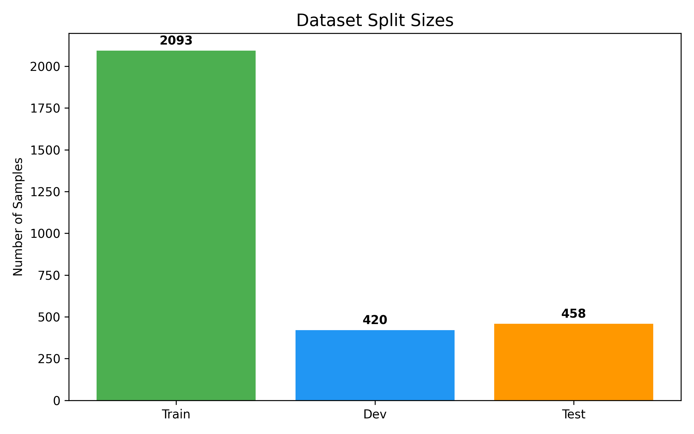
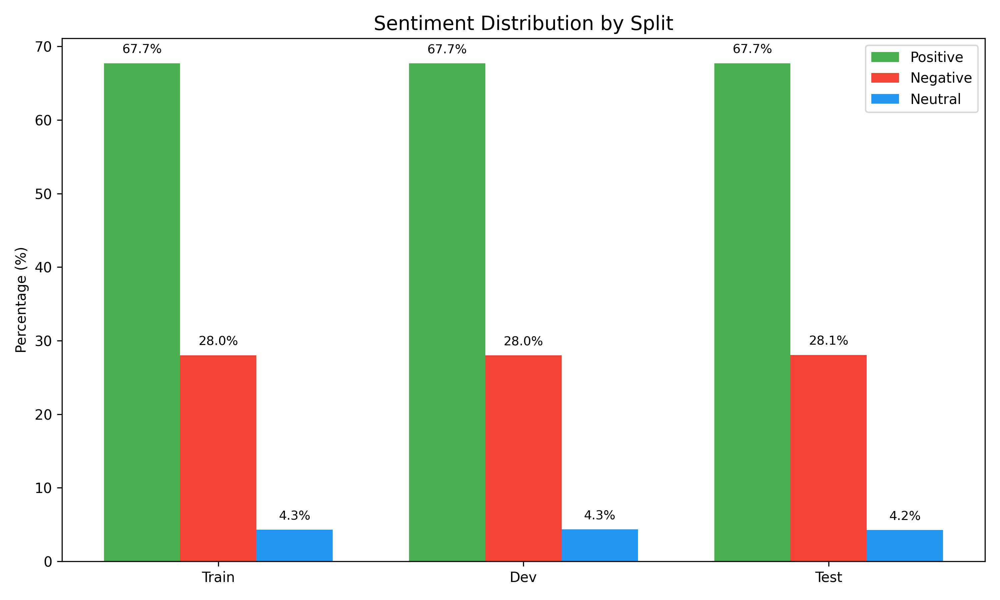
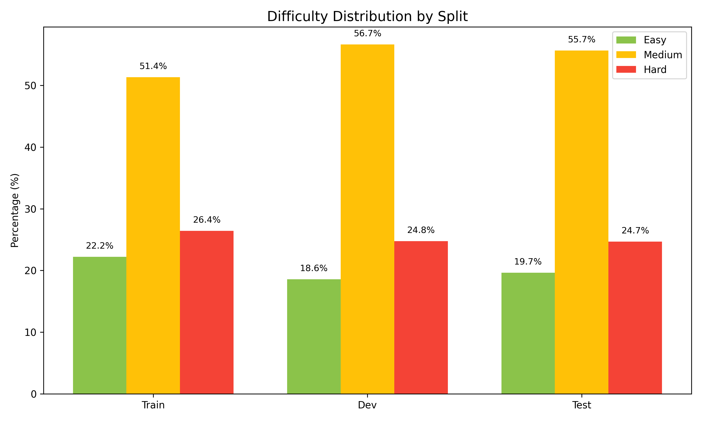
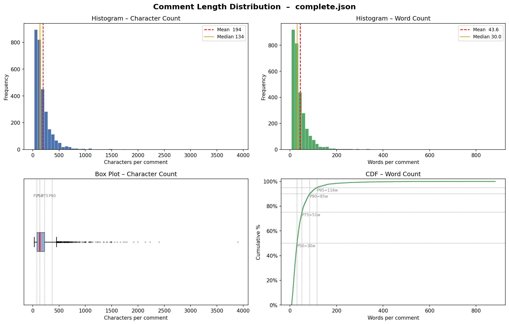
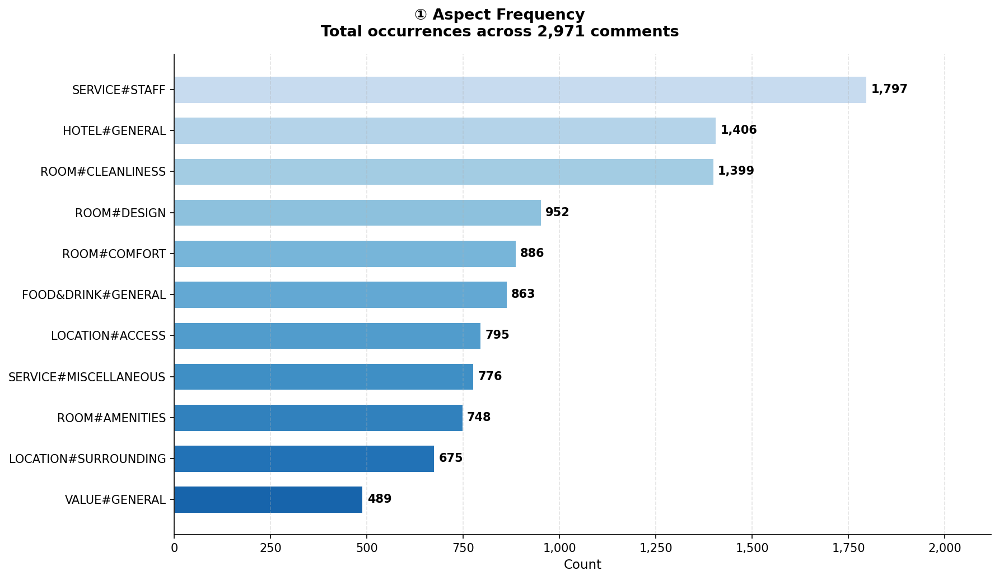
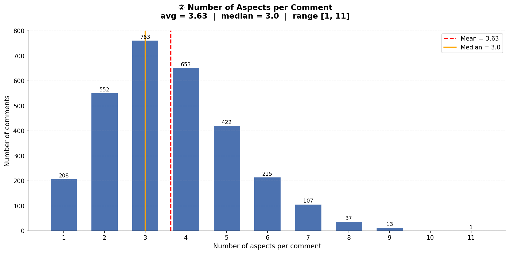
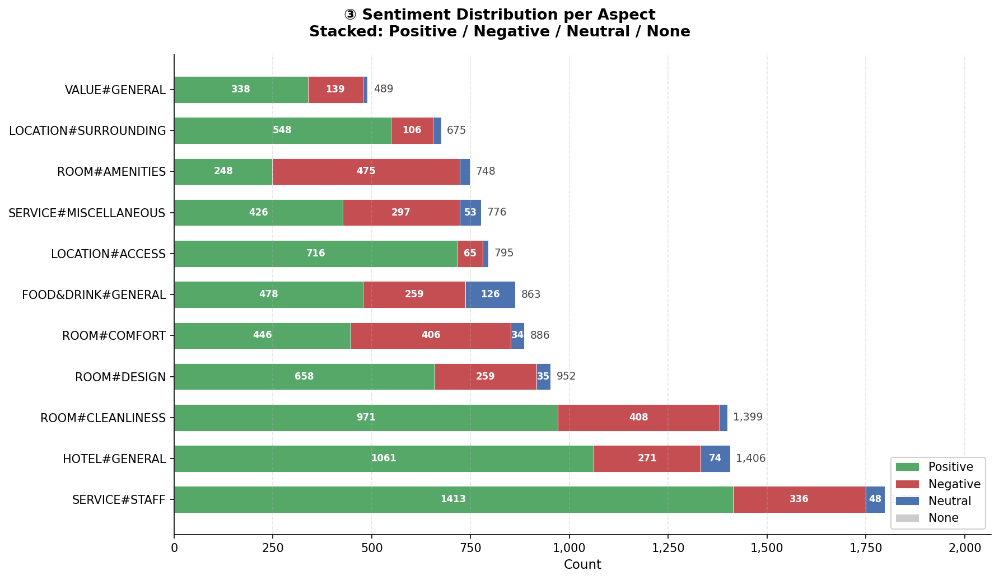

# 🏨 ViHotel3k: Vietnamese Hotel Reviews Dataset for Aspect-Based Sentiment Analysis

[](https://www.python.org/)
[](LICENSE)

**ViHotel3k** is a high-quality Vietnamese hotel review dataset curated specifically for the **Aspect-Based Sentiment Analysis (ABSA)** task. The dataset contains fine-grained annotations across multiple aspects and sentiment polarities, serving as a robust benchmark for evaluating natural language processing (NLP) models on Vietnamese customer opinions.

---

## 📂 Project Directory Structure

The repository is organized into a clean and structured layout:
```text
ViHotel3k/
├── assets/                  # Project visualization charts
│   ├── chart*.png           # Aspect and sentiment breakdown charts
│   └── split*.png           # Split distribution charts
├── data/                    # Dataset directory containing raw data files
│   ├── train.json           # Training split
│   ├── dev.json             # Validation split
│   └── test.json            # Evaluation split
├── CONTRIBUTE.md            # Guidelines for open-source contributions
├── LICENSE                  # MIT License details
└── README.md                # Project documentation
```

---

## 📊 1. Dataset Analysis & Visualization

The ViHotel3k dataset is pre-split into **Train**, **Dev**, and **Test** sets. Below is a comprehensive breakdown of the dataset characteristics based on the analytical charts included in the `assets/` folder:

### 📦 Dataset Splits & Sentiment Distributions

These charts illustrate the split sizes, overall sentiment distributions, and sample difficulty across the data splits:

<p align="center">
  
  
  
</p>

*   **Split Sizes (`split_sizes.png`):** Shows a well-balanced distribution of samples across the training, validation (dev), and testing sets, ensuring robust model training and unbiased evaluation.
*   **Sentiment Distribution (`split_sentiment_dist.png`):** Visualizes the proportions of `Positive`, `Negative`, and `Neutral` sentiments across all splits, demonstrating consistent label distribution.
*   **Difficulty Distribution (`split_difficulty_dist.png`):** Evaluates the complexity levels of reviews in each split to guarantee that validation and test sets present realistic evaluation challenges.

---

### 📝 Text Characteristics

This chart depicts the word count distribution of reviews in the dataset:

<p align="center">
  
</p>

*   **Comment Length (`comment_length_dist.png`):** Illustrates the word-level length distribution of hotel reviews. The dataset spans from short, concise remarks to long, elaborate multi-sentence testimonials, posing a robust challenge for context learning.

---

### 🏷️ Aspect & Sentiment Breakdown

ViHotel3k captures fine-grained opinions across **11 core aspects** of the hospitality industry. The frequencies and sentiment polarities per aspect are detailed below:

<p align="center">
  
  
</p>

<p align="center">
  
</p>

*   **Aspect Frequencies (`chart1_aspect_frequency.png`):** Details the total label count for each of the 11 aspects. High-frequency categories like room cleanliness (`ROOM#CLEANLINESS`), staff service (`SERVICE#STAFF`), accessibility (`LOCATION#ACCESS`), and overall rating (`HOTEL#GENERAL`) represent the primary areas of customer concern.
*   **Aspects per Comment (`chart2_aspects_per_comment.png`):** Demonstrates the **multi-aspect** nature of the dataset. A single review frequently expresses opinions about multiple aspects (e.g., *"Clean room but unfriendly staff"* triggers `ROOM#CLEANLINESS` and `SERVICE#STAFF`), demanding models that can model joint aspect extractions.
*   **Sentiment per Aspect (`chart3_sentiment_per_aspect.png`):** Shows the breakdown of `Positive`, `Negative`, and `Neutral` sentiments for each aspect. This reveals inherent local class imbalances (e.g., `VALUE#GENERAL` and `SERVICE#STAFF` trend positive, while equipment issues in `ROOM#AMENITIES` show higher negative ratios).

---

## 🤝 2. Contributing

If you wish to contribute to this project (e.g., adding annotations, proposing new data samples, or correcting existing labels), please read our comprehensive [CONTRIBUTE.md](CONTRIBUTE.md) guidelines. We welcome all community efforts to enhance dataset size and annotation quality!

---

## 📄 3. License

This project is licensed under the terms of the **MIT License** - see the [LICENSE](LICENSE) file for details.
